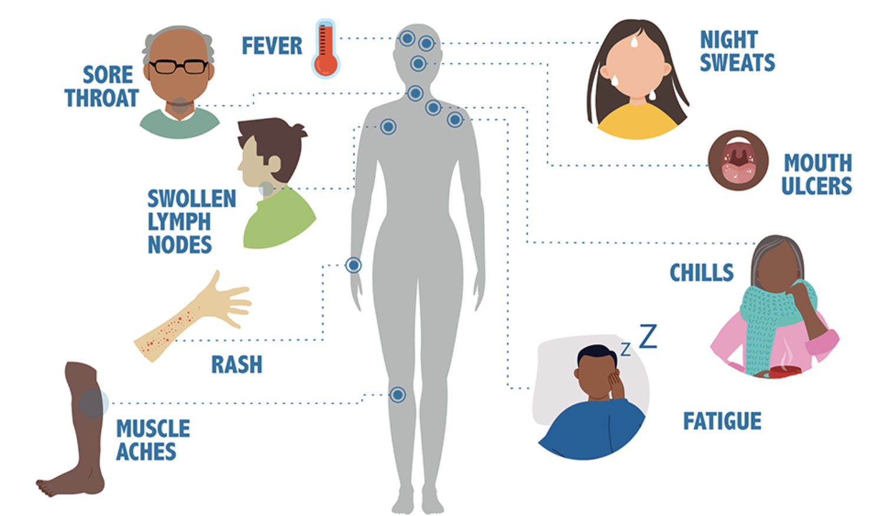

## What is HIV
* HIV (human immunodeficiency virus) is a virus that attacks the body’s immune system. If HIV is not treated, it can lead to [AIDS](https://www.cdc.gov/hiv/basics/livingwithhiv/opportunisticinfections.html) (acquired immunodeficiency syndrome).

* There is currently no effective cure. Once people get HIV, they have it for life.

* But with proper medical care, HIV can be controlled. People with HIV who get [effective HIV treatment](https://www.cdc.gov/hiv/basics/livingwithhiv/treatment.html) can live long, healthy lives and protect their partners.

## Where did HIV come from?
* HIV infection in humans came from a type of chimpanzee in Central Africa. Studies show that HIV may have jumped from chimpanzees to humans as far back as the late 1800s.

* The chimpanzee version of the virus is called simian immunodeficiency virus. It was probably passed to humans when humans hunted these chimpanzees for meat and came in contact with their infected blood.

* Over decades, HIV slowly spread across Africa and later into other parts of the world. The virus has existed in the United States since at least the mid to late 1970s.

## HIV Transmission
Most people who get HIV get it through anal or vaginal sex, or sharing needles, syringes, or other drug injection equipment (for example, cookers). But there are powerful tools that can help prevent HIV transmission. [More info in CDC](https://www.cdc.gov/hiv/basics/hiv-transmission/increase-hiv-risk.html)

## How do I know if I have HIV?
The only way to know if you have HIV is to [get tested](https://www.cdc.gov/hiv/basics/testing.html). Knowing your HIV status helps you make healthy decisions to prevent getting or transmitting HIV.

## Are there symptoms?

* For many, yes. Most people have flu-like symptoms within 2 to 4 weeks after infection. Symptoms may last for a few days or several weeks.

* Having these symptoms alone doesn’t mean you have HIV. Other illnesses can cause similar symptoms.

* Some people have no symptoms at all. The only way to know if you have HIV is to get tested.

[Reference](https://www.cdc.gov/hiv/basics/whatishiv.html)

